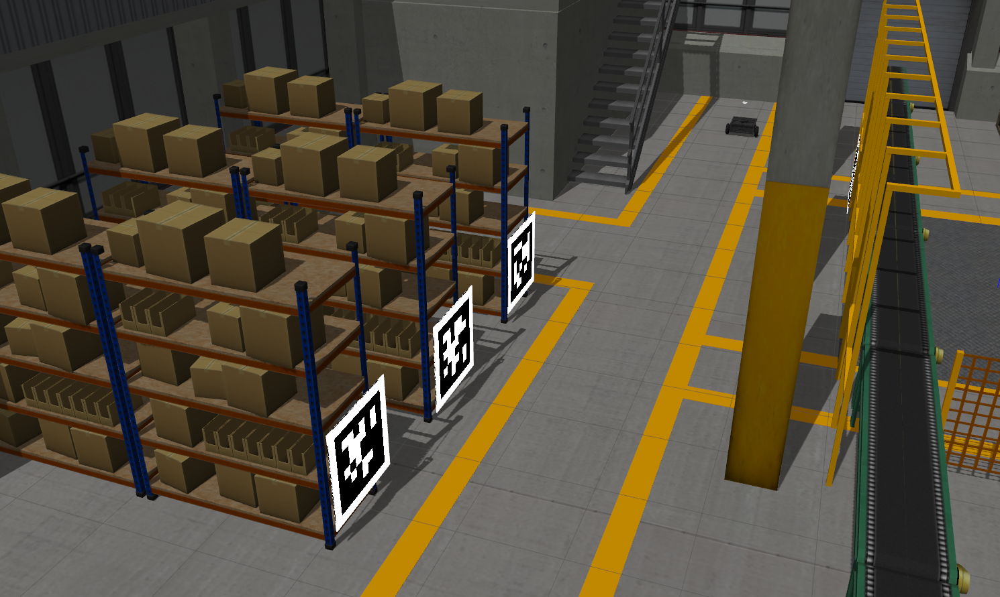
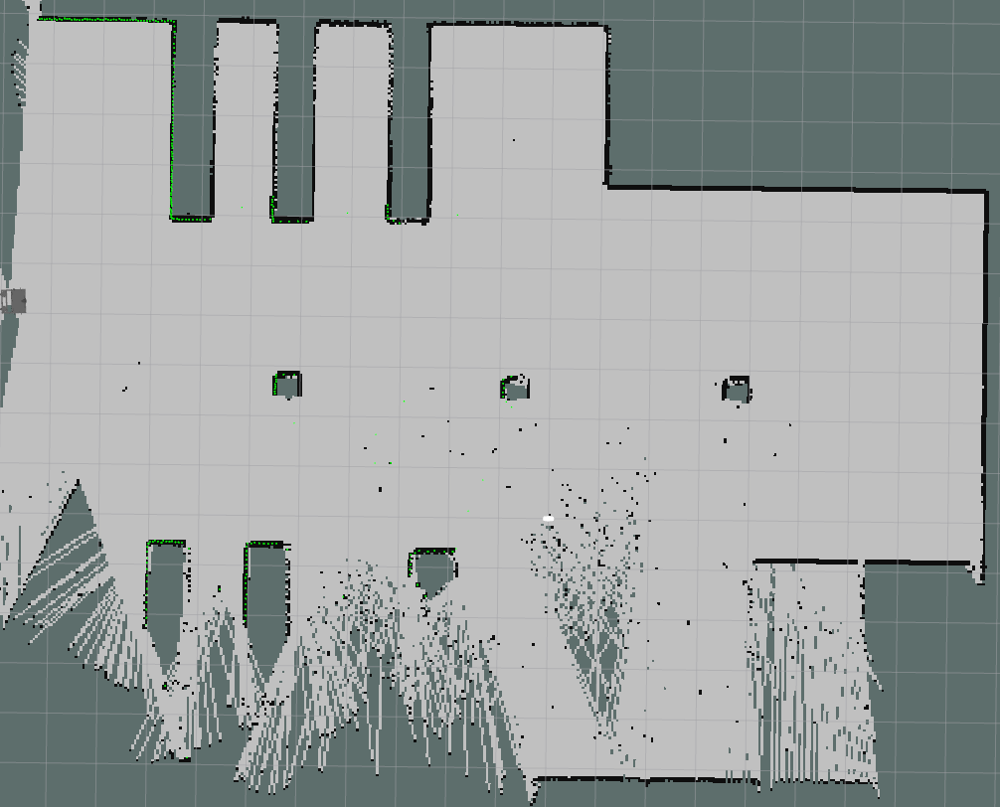
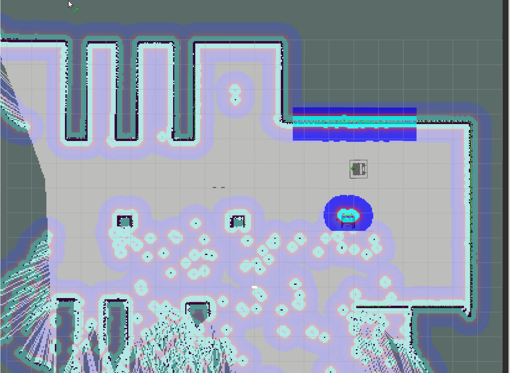

# SLAM and Navigation packages in 2D environments
This repository includes SLAM and naviagation packages in 2D environments.
The original codes are motivated by OMOR1-navigation [package](https://github.com/omorobot/omo_r1)

## SLAM (for mapping) Instruction
 - To run mapping and navigation task of OMO-R1 robot in factory environments
 - In omorobot workspace
   - You can also integrate all launch files in a single file
   - We just run all launch files all different terminals for some educational purposes
    ~~~
    # Terminal 1 (Gazebo)
    roslaunch omo_r1_gazebo omo_r1_yjlink.launch  # Launch gazebo with predefiend gazebo env (see launch)
    # Terminal 2 (Description)
    roslaunch omo_r1_bringup omo_r1_remote.launch # Publish robot descriptions
    # Terminal 3 (Teleoperation: Keyboard)
    roslaunch omo_r1_teleop omo_r1_teleop_key.launch # Control robots using keyboards

    # Terminal 4 (SPARO 2d SLAM)
    roslaunch sparo_2d_slam sparo_2d_slam.launch # SPARO 2D SLAM package (Currently, Gmapping-based)
    ~~~

    
    

   - After building a map, you can simply save the map (__/map__ topic) with following command
    ~~~
    # New Terminal (map server)
    rosrun map_server map_saver -f mymap # /map will be save as pgm (image) and cfgs (yaml)
    ~~~

    

## Navigation Instruction
 - In omorobot workspace
   - You can also integrate all launch files in a single file
   - We just run all launch files all different terminals for some educational purposes
    ~~~
    # Terminal 1 (Gazebo)
    roslaunch omo_r1_gazebo omo_r1_yjlink.launch  # Launch gazebo with predefiend gazebo env (see launch)
    # Terminal 2 (Description)
    roslaunch omo_r1_bringup omo_r1_remote.launch # Publish robot descriptions

    # Terminal 3 (Navigation package)
    roslaunch sparo_2d_navigation sparo_2d_navigation_gazebo.launch # Launch navigation package with pre-built map (saved in map folder)
    ~~~

    

